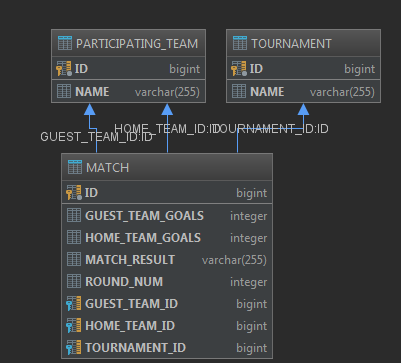

## Як запустити

Додаток можна легко декількома способами:

* Відкрити проект в IDE і запустити main class TournamentApplication
* З мавена:

```cmd
mvn spring-boot:run
```

* За допомогою докера:

```cmd
mvn package
docker-compose up
```

З технічних причин (працюю зі слабкого ноутбука) я не маю можливості/часу перевірити справність
докер білда та перенести виклик мавена в докер файл. 
Якщо додаток не буде працювати в докері велике прохання спробувати інші варіанти. 

## База даних

Додаток написано без прив"язки до конкретної бази даних, може використовуватися будь яка SQL (MySQL, Oracle, Postgres, etc)

Структура бази даних зображена на схемі db.png



## Unit тести

Тести не написані через брак часу. Єдиний тест TournamentApplicationTests перевіряє що додаток успішно стартує.

## Алгоритм

В додатку використано алгоритм: https://stackoverflow.com/questions/6648512/scheduling-algorithm-for-a-round-robin-tournament

## Виконані критерії:

* Створення валідного розкладу
* Весь описаний API
* Зберігання результатів в SQL базі даних
* Наявність API Doc (використано Swagger)
* Докер
* Побудова pdf репорта

Тести на експорт/імпорт csv файлу а також інтеграція з sheets api не виконана за браком часу.

## Опис API

API має Swagger документацію доступну за посиланням: http://localhost:8080/swagger-ui.html#/tournament-controller

Якщо коротко:

* Створення турніру: POST /tournament
* Записати результати матчу PUT /result/{tournamentName}
* Переглянути результати турніру GET /result/{tournamentName} (Розклад зустрічей по раундам з результатами 
та таблиця результатів по командам)
* Переглянути зіграні/не зіграні матчі GET /result/{tournamentName}/matches?played=true
* Загрузити pdf репорт з результами: GET /result/pdf/{tournamentName} (в постмені зручно робити 
Send and Download)

Приклади респонсів:

Створення турніру
```json
{
    "tournamentName": "Our_Tournament2",
    "rounds": [
        {
            "roundNum": 1,
            "matches": [
                {
                    "homeTeam": "Team4",
                    "guestTeam": "Team3",
                    "homeTeamGoals": null,
                    "guestTeamGoals": null,
                    "matchResult": null
                },
                {
                    "homeTeam": "Team2",
                    "guestTeam": "Team1",
                    "homeTeamGoals": null,
                    "guestTeamGoals": null,
                    "matchResult": null
                }
            ]
        },
        {
            "roundNum": 2,
            "matches": [
                {
                    "homeTeam": "Team4",
                    "guestTeam": "Team2",
                    "homeTeamGoals": null,
                    "guestTeamGoals": null,
                    "matchResult": null
                },
                {
                    "homeTeam": "Team1",
                    "guestTeam": "Team3",
                    "homeTeamGoals": null,
                    "guestTeamGoals": null,
                    "matchResult": null
                }
            ]
        },
        {
            "roundNum": 3,
            "matches": [
                {
                    "homeTeam": "Team4",
                    "guestTeam": "Team1",
                    "homeTeamGoals": null,
                    "guestTeamGoals": null,
                    "matchResult": null
                },
                {
                    "homeTeam": "Team3",
                    "guestTeam": "Team2",
                    "homeTeamGoals": null,
                    "guestTeamGoals": null,
                    "matchResult": null
                }
            ]
        },
        {
            "roundNum": 4,
            "matches": [
                {
                    "homeTeam": "Team3",
                    "guestTeam": "Team4",
                    "homeTeamGoals": null,
                    "guestTeamGoals": null,
                    "matchResult": null
                },
                {
                    "homeTeam": "Team1",
                    "guestTeam": "Team2",
                    "homeTeamGoals": null,
                    "guestTeamGoals": null,
                    "matchResult": null
                }
            ]
        },
        {
            "roundNum": 5,
            "matches": [
                {
                    "homeTeam": "Team2",
                    "guestTeam": "Team4",
                    "homeTeamGoals": null,
                    "guestTeamGoals": null,
                    "matchResult": null
                },
                {
                    "homeTeam": "Team3",
                    "guestTeam": "Team1",
                    "homeTeamGoals": null,
                    "guestTeamGoals": null,
                    "matchResult": null
                }
            ]
        },
        {
            "roundNum": 6,
            "matches": [
                {
                    "homeTeam": "Team1",
                    "guestTeam": "Team4",
                    "homeTeamGoals": null,
                    "guestTeamGoals": null,
                    "matchResult": null
                },
                {
                    "homeTeam": "Team2",
                    "guestTeam": "Team3",
                    "homeTeamGoals": null,
                    "guestTeamGoals": null,
                    "matchResult": null
                }
            ]
        }
    ]
}
```

Не зіграні матчі

```json
[
    {
        "homeTeam": "Team2",
        "guestTeam": "Team3",
        "homeTeamGoals": null,
        "guestTeamGoals": null,
        "matchResult": null
    },
    {
        "homeTeam": "Team1",
        "guestTeam": "Team4",
        "homeTeamGoals": null,
        "guestTeamGoals": null,
        "matchResult": null
    },
    {
        "homeTeam": "Team2",
        "guestTeam": "Team1",
        "homeTeamGoals": null,
        "guestTeamGoals": null,
        "matchResult": null
    },
    {
        "homeTeam": "Team4",
        "guestTeam": "Team3",
        "homeTeamGoals": null,
        "guestTeamGoals": null,
        "matchResult": null
    },
    {
        "homeTeam": "Team2",
        "guestTeam": "Team4",
        "homeTeamGoals": null,
        "guestTeamGoals": null,
        "matchResult": null
    },
    {
        "homeTeam": "Team3",
        "guestTeam": "Team1",
        "homeTeamGoals": null,
        "guestTeamGoals": null,
        "matchResult": null
    },
    {
        "homeTeam": "Team3",
        "guestTeam": "Team2",
        "homeTeamGoals": null,
        "guestTeamGoals": null,
        "matchResult": null
    },
    {
        "homeTeam": "Team4",
        "guestTeam": "Team1",
        "homeTeamGoals": null,
        "guestTeamGoals": null,
        "matchResult": null
    },
    {
        "homeTeam": "Team1",
        "guestTeam": "Team2",
        "homeTeamGoals": null,
        "guestTeamGoals": null,
        "matchResult": null
    },
    {
        "homeTeam": "Team3",
        "guestTeam": "Team4",
        "homeTeamGoals": null,
        "guestTeamGoals": null,
        "matchResult": null
    },
    {
        "homeTeam": "Team4",
        "guestTeam": "Team2",
        "homeTeamGoals": null,
        "guestTeamGoals": null,
        "matchResult": null
    },
    {
        "homeTeam": "Team1",
        "guestTeam": "Team3",
        "homeTeamGoals": null,
        "guestTeamGoals": null,
        "matchResult": null
    }
]
```